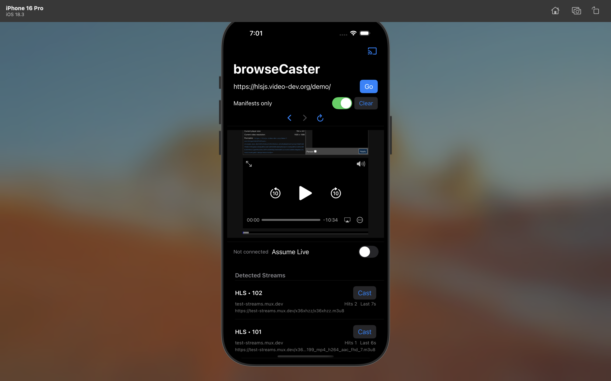

# browseCaster

An iOS "cast browser" that lets you open arbitrary websites inside the app and cast detected video streams to a Chromecast dongle-even when the site doesn't provide a native cast button. It surfaces candidate media URLs so you can choose the right one and send it directly to the TV.

## App Screenshot




## What it does (how it works)

- You load a website in an in-app `WKWebView`.
- The app injects JavaScript to observe `fetch`/`XMLHttpRequest` (and optionally media element URLs) and detect media URLs like HLS `.m3u8`, DASH `.mpd`, and MP4.
- Detected URLs are deduped, scored, and listed; you manually pick the correct stream (often avoiding ad or tracking streams).
- The Google Cast iOS Sender SDK tells the Chromecast to load the selected URL directly-TV playback happens on the Chromecast, while the phone acts as a remote.

## Features

- In-app browser (URL bar, back/forward/reload)
- Stream candidate detection (m3u8/mpd/mp4)
- Manual selection + cast to Chromecast
- Optional toggles such as manifests-only, assume-live, and clear list

## Limitations (why some sites fail)

Chromecast is not mirroring your phone-it fetches media itself using its own network stack. That means:

- It doesn't have your phone's cookies or session headers.
- Some URLs return 403 or require auth, referer headers, expiring tokens, geo-restrictions, or DRM.
- This project does not bypass DRM, paywalls, or security controls; it simply observes what the page requests and tries to cast publicly playable streams.

## Tech stack

- Swift / SwiftUI
- `WKWebView` + `WKUserScript` + `WKScriptMessageHandler`
- Google Cast iOS Sender SDK (CocoaPods)

## Code structure

- `AppDelegate.swift` - Cast SDK initialization
- `CastButtonView.swift` - wraps `GCKUICastButton` for SwiftUI
- `BrowserView.swift` - main UI: URL bar + candidate list
- `WebView.swift` - `WKWebView` wrapper + JS injection + message handler
- `StreamStore.swift` - dedupe, classify, score candidates
- `CastManager.swift` - casts selected candidate via remote media client
- `Utils.swift` - helpers: classification/scoring/formatting

## Setup / Run locally

Requirements
- macOS + Xcode
- Physical iPhone (recommended for Cast testing)
- Chromecast on the same network

Install pods and open the workspace
```bash
cd browseCaster
pod install
open browseCaster.xcworkspace
```

Run on device
- Select your connected iPhone target in Xcode and Run.
- Ensure your phone and Chromecast are on the same Wi-Fi network.

Info.plist permissions
- Local network access is required for Chromecast discovery:
  - `NSLocalNetworkUsageDescription`
  - `NSBonjourServices` with `_googlecast._tcp` and the default receiver app ID entry

## Roadmap / Next steps

- Auto-select best candidate (better heuristics, reduce ad noise)
- Playback controls (pause/stop/seek/volume)
- Optional screen-mirroring fallback (iOS -> Chromecast mirroring is non-trivial and may be blocked for protected content; possible directions include ReplayKit, WebRTC, or a custom receiver)
